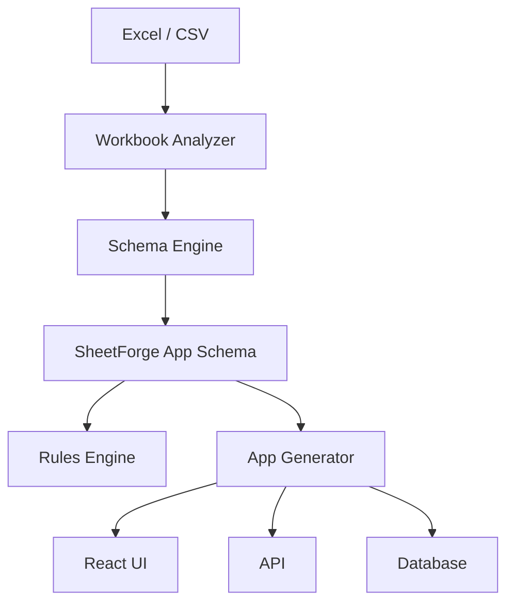

# Arquitetura

## Componentes

### 1. Workbook Analyzer
Lê o arquivo original e extrai abas, cabeçalhos, dados amostrais, fórmulas e metadados.

### 2. Schema Engine
Converte a análise em entidades, campos, tipos, chaves e relações.

### 3. Business Rules Engine
Futuro componente responsável por traduzir fórmulas, validações e estados em regras declarativas.

### 4. SheetForge App Schema
Contrato intermediário entre a origem dos dados e a aplicação gerada.

### 5. App Generator
Futuro gerador de CRUD, dashboards, workflows, API e persistência.

## Fluxo

## Decisão principal

O App Schema é o núcleo do produto. A aplicação nunca deve depender diretamente da estrutura física do workbook depois da etapa de ingestão. Isso evita que regras de interface, persistência e geração fiquem amarradas ao Excel.
